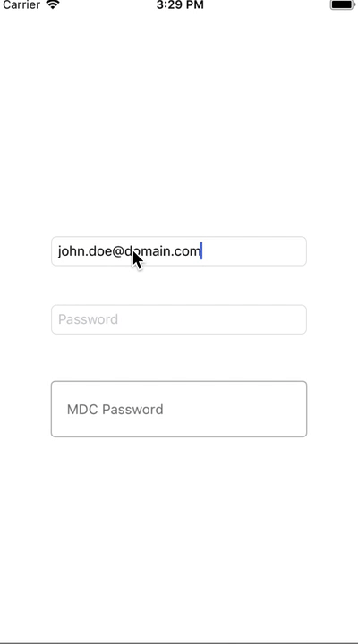

# HideShowPassword
HideShowPassword is an easy to use xamarin ios extension of UITextField and/or the MaterialComponents TextField to toggle the password visibility in a text field. Just tap the eye icon on right view to toggle visibility.

<link href='//fonts.googleapis.com/css?family=RobotoDraft:regular,bold,italic,thin,light,bolditalic,black,medium&amp;lang=en' rel='stylesheet' type='text/css'>

<h1 align="center">
  HideShowPassword for Xamarin.iOS
</h1>

   

## NuGet
* [Plugin.HideShowPassword.iOS](http://www.nuget.org/packages/Plugin.HideShowPassword.iOS) 

# License #

Xamarin HideShowPassword for iOS

Copyright (c) 2019 Xamarin HideShowPassword for iOS Authors.

Licensed under the Apache License, Version 2.0 (the "License");
you may not use this file except in compliance with the License.
You may obtain a copy of the License at

   http://www.apache.org/licenses/LICENSE-2.0

Unless required by applicable law or agreed to in writing, software
distributed under the License is distributed on an "AS IS" BASIS,
WITHOUT WARRANTIES OR CONDITIONS OF ANY KIND, either express or implied.
See the License for the specific language governing permissions and
limitations under the License.
